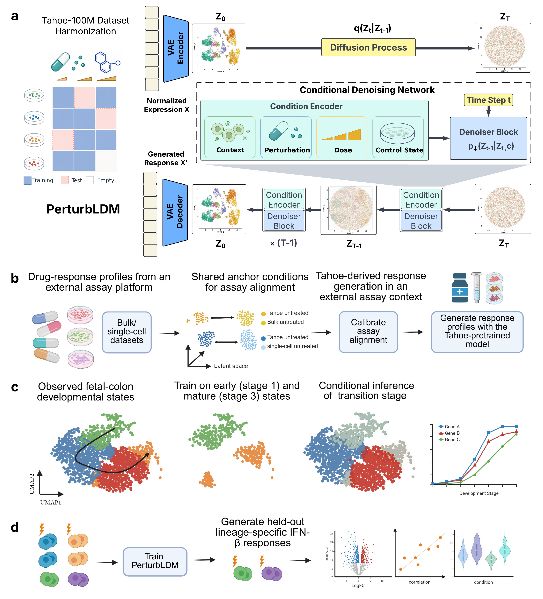

# PerturbLDM

Code accompanying **PerturbLDM: conditional latent diffusion for modelling single-cell perturbation responses**.

## Overview

<a href="docs/figures/fig1_PerturbLDM.pdf">
  
</a>

**Figure 1 | PerturbLDM framework and scale-to-application evaluation design.** **a,** Tahoe-100M provides the atlas-scale pretraining and quantitative benchmarking setting. PerturbLDM combines a variational autoencoder with conditional latent diffusion under cellular-context, perturbation, dose and control-state conditioning. **b,** In PANACEA, shared anchor conditions calibrate an external assay before Tahoe-derived profiles are organised by predicted pathway effects. **c,** In fetal colon, broad-stage 1 and 3 enterocytes provide the observed developmental anchors used to generate the pooled held-out broad-stage 2 population, without PCW-specific conditioning. **d,** In PBMCs, retained controls support generation of three held-out, lineage-specific IFN-beta response states.

Tahoe-100M supplies the study's central quantitative evidence. PANACEA examines
downstream reuse of Tahoe-derived predictions after assay calibration, whereas
the fetal-colon and PBMC analyses fit the same generative framework separately
to smaller, study-specific datasets. Evaluation spans complete expression
profiles, matched-control effects, response genes and programmes, and local
population distributions.

## Repository layout

- `PerturbLDM/`: core latent VAE and conditional diffusion implementation, colon/PBMC configurations and runnable examples.
- `PerturbLDM/examples/pbmc_ifnb/`: PBMC IFN-beta response-transfer example and exact hold-out definition.
- `PerturbLDM/examples/cellline_drug_dose_tahoe/`: Tahoe training and inference entry points.
- `benchmarks/tahoe_random_split/`: MLP, random-forest, CPA and chemCPA benchmark code plus figure wrappers.
- `docs/figures/`: the manuscript overview figure in PDF and README-preview formats.

## Installation

Python ≥3.10 is required. Create an isolated environment and install
PerturbLDM directly from GitHub:

```bash
python3 -m venv .venv
source .venv/bin/activate
python -m pip install --upgrade pip
python -m pip install torch --index-url https://download.pytorch.org/whl/cpu
python -m pip install \
  "perturbldm[pbmc] @ git+https://github.com/davidroad/PerturbLDM.git"
env -u LD_LIBRARY_PATH python -c "import PerturbLDM; print(PerturbLDM.__file__)"
```

The explicit PyTorch command installs the CPU wheel used by the PBMC example.
GPU users should instead install the PyTorch build matching their CUDA runtime
before installing PerturbLDM.

Some managed clusters export another environment's PyTorch libraries through
`LD_LIBRARY_PATH`. If `import torch` reports a missing C-extension symbol even
though `pip check` passes, verify the isolated environment without that inherited
path:

```bash
env -u LD_LIBRARY_PATH python -c "import torch; print(torch.__version__)"
```

Use the same prefix for the PBMC test on such a cluster:

```bash
env -u LD_LIBRARY_PATH python -m PerturbLDM.examples.test_pbmc_training \
  --input /path/to/pbmc_IFN_filtered.h5ad \
  --output-dir outputs/pbmc_example \
  --device cpu
```

## Five-minute PBMC diffusion example

The installed command below runs a standalone CPU-safe end-to-end example on
the PBMC dataset from [Kang et al., *Nature Biotechnology* 36, 89–94
(2018)](https://doi.org/10.1038/nbt.4042), available from
[GEO GSE96583](https://www.ncbi.nlm.nih.gov/geo/query/acc.cgi?acc=GSE96583).
It is designed to complete within five minutes on a conventional CPU; actual
time depends on hardware. The processed input is not bundled: supply a
compatible GSE96583-derived H5AD containing the `cell.type` and `stim`
observation columns.

```bash
python -m PerturbLDM.examples.test_pbmc_training \
  --input /path/to/pbmc_IFN_filtered.h5ad \
  --output-dir outputs/pbmc_example \
  --device cpu
```

The Python test prints eight numbered stages, periodic latent-model and
diffusion losses, condition-level diagnostic correlations and the absolute
output directory. A completed run ends with:

```text
[Step 8/8] Validate the run and report completion
[SUCCESS] PerturbLDM test training completed.
Outputs: /absolute/path/to/outputs/pbmc_example
```

Any uncaught error or failed finite-value/shape check prints `[FAILED]` and
returns a non-zero exit status. The equivalent installed command is
`perturbldm-pbmc-example`.

The command validates the required `cell.type` and `stim` metadata, applies the
response-transfer hold-out of IFN-beta-stimulated B cells, CD8 T cells and
FCGR3A+ monocytes, fits compact latent and conditional-diffusion models and
generates the held-out states. It writes `pbmc_example_summary.json`,
`training_losses.png`, `prediction_diagnostics.png`, `training_history.csv`,
`condition_metrics.csv`, the selected genes, cell-level held-out predictions,
condition-mean profiles, run configuration and both model checkpoints. The
summary indexes every artifact and includes shape and finite-value checks plus
diagnostic whole-state and matched-control-relative metrics.

This is a self-contained teaching and execution example, not manuscript
reproduction or benchmark evidence. Its fixed defaults use all available cells
after the response-transfer split (11,842 fitting and 1,710 held-out cells in
the supplied object), 1,000 training-selected HVGs, a 64-dimensional latent
space, 40 latent-model epochs, 160 diffusion epochs and 50 inference steps. It
does not run hyperparameter search or cross-validation. The verified default
run completed in 125 seconds with 1.88 GB peak memory on the reference CPU
server; runtime varies with hardware. The legacy `perturbldm-pbmc-smoke`
command is retained as an alias.

## Full PBMC example

The full manuscript workflow requires CUDA and a compatible GPU. CPU users
should use the five-minute PBMC diffusion example above. For the full workflow,
stage the processed GSE96583-derived object under the documented relative path,
then run:

```bash
cd PerturbLDM
python -u examples/exp_pbmc_ifn.py \
  --basedir external_inputs/pbmc \
  --output_dir outputs/pbmc_ifnb \
  --topgenenum 2000 --subtype mse --cuda_id 0
```

See `PerturbLDM/examples/pbmc_ifnb/README.md` for the biological task, split and preprocessing.

## Tahoe benchmarks and source data

The Tahoe code and paired Figshare tables support the held-out benchmark,
including absolute-expression, matched-control-effect, gene-program and local
distribution summaries. The repository also recreates the absolute-expression
comparison and Supplementary Fig. S3e-h model-selection diagnostics. Commands
are documented in `benchmarks/tahoe_random_split/README.md`.

PANACEA source tables are distributed in the paired Figshare deposit; its
atlas-scale model fitting and large intermediate prediction objects are not
bundled as a standalone GitHub workflow.

## Data

Raw and processed H5AD files are obtained from the sources cited in the
manuscript and staged outside the repository. Large model checkpoints, latent
tensors and per-cell predictions are likewise kept outside GitHub. The paired
Figshare deposit contains the compact source tables underlying the reported
figures and statistics.

The code is released under the MIT License.
